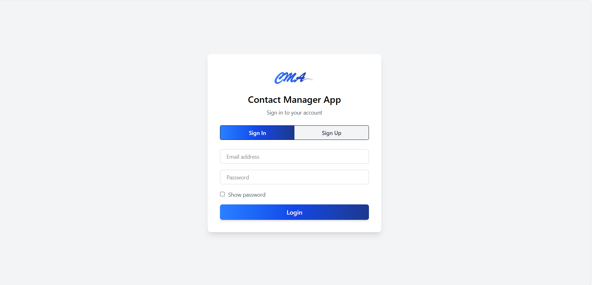
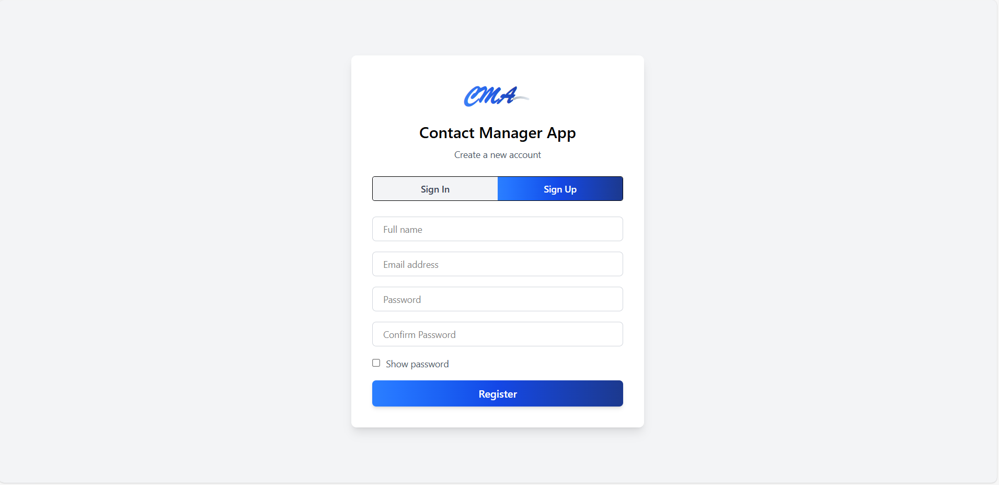
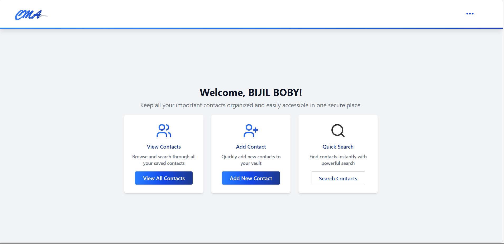
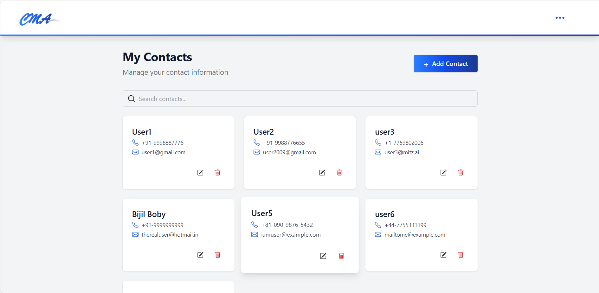
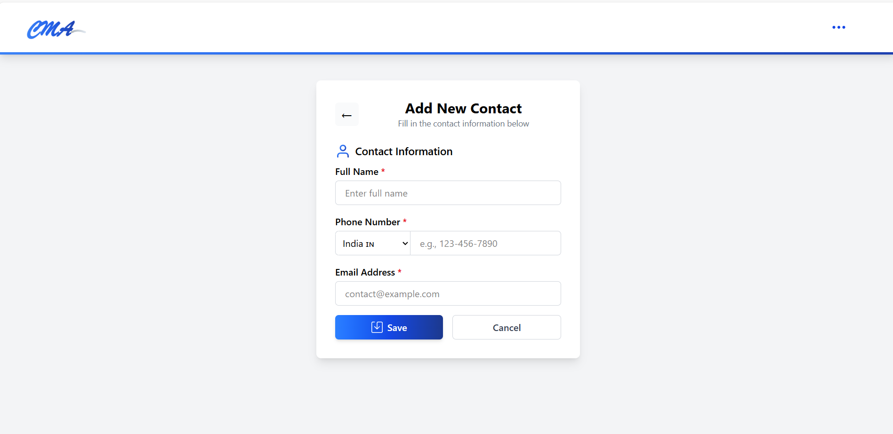

# 📇 Contact Manager App (CMA)

A full-stack Contact Management Application built with **React.js** and **Node.js (Express)** that allows users to securely register, login, and manage personal contacts with a clean, modern interface.

---

## 🚀 Features

- 🔐 User Authentication (JWT-based Login/Register)
- 📇 Add, Edit, Delete, and Search Contacts
- 🧾 Contact Information: Name, Email, Phone Number (with country code)
- 🙋 Personalized Welcome Message using logged-in user info
- 🔍 Live Search and Filtering of Contacts
- 🎨 Beautiful Responsive UI with Popup Modals and Dashboard Cards

---

## 🖥️ User Interface Overview

### 🔐 Login/Register  Page (SignIn)


### 🔐 Login/Register  Page (SignUp)


### 🏠 Home Page (After Login)


### 📇 Contact List Page with Search


### ➕ Add New Contact


### 📝 Edit Contact Popup


---


---


## 🧪 API Testing using Postman

### ✅ Register

- **POST** `/api/auth/register`
- Body:
```json
{
  "name": "Bijil Boby",
  "email": "bijil@example.com",
  "password": "123456"
}
```

### 🔐 Login

- **POST** `/api/auth/login`
- Body:
```json
{
  "email": "bijil@example.com",
  "password": "123456"
}
```

### 🙋 Get Logged-in User Info

- **GET** `/api/auth/me`
- Header: `Authorization: Bearer <token>`

### 📇 Contacts CRUD (Auth required)

- **GET** `/api/contacts` - List all contacts of the logged-in user
- **POST** `/api/contacts` - Add new contact
- **PUT** `/api/contacts/:id` - Update contact
- **DELETE** `/api/contacts/:id` - Delete contact

---

## 🛠️ Technologies Used

- **Frontend:** React.js, Axios, Context API, Tailwind CSS
- **Backend:** Node.js, Express.js, MongoDB, JWT, Bcrypt.js
- **Database:** MongoDB with Mongoose

---

## 📥 Setup Instructions

1. **Clone the repository**
```bash
git clone https://github.com/yourusername/contact-manager-app.git
cd contact-manager-app
```

2. **Install backend dependencies**
```bash
cd backend
npm install
```
3. **Create `.env` file in backend**
```
MONGO_URI=your_mongodb_uri
JWT_SECRET=your_secret_key
PORT=5000
```

4. **Start backend server**
```bash
npm run server
```

5. **Install frontend dependencies**
```bash
cd ../frontend
npm install
```

6. **Create `.env` in frontend**
```
REACT_APP_API=http://localhost:5000/api
```

7. **Start frontend**
```bash
npm start
```

---

## ✨ UI Overview

- **Login/Register Page:** Tab switch for sign-in and sign-up.
- **Home Dashboard:** Displays 3 action cards (View, Add, Search).
- **Contact Page:** List of contact cards with edit and delete icons.
- **Add Contact Page:** Clean form to add new contact.
- **Edit Popup:** Blurred background modal for smooth UX.

---

## 📄 License

This project is open-source and free to use.

---

> Built with ❤️ by Bijil Boby
